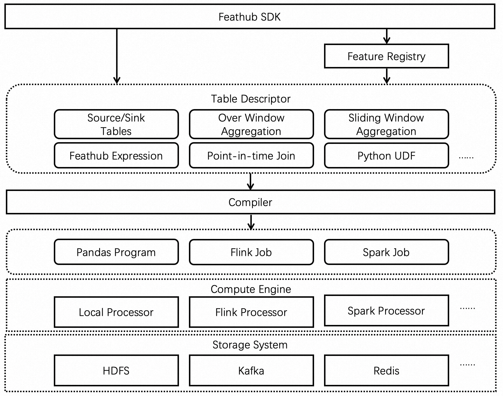
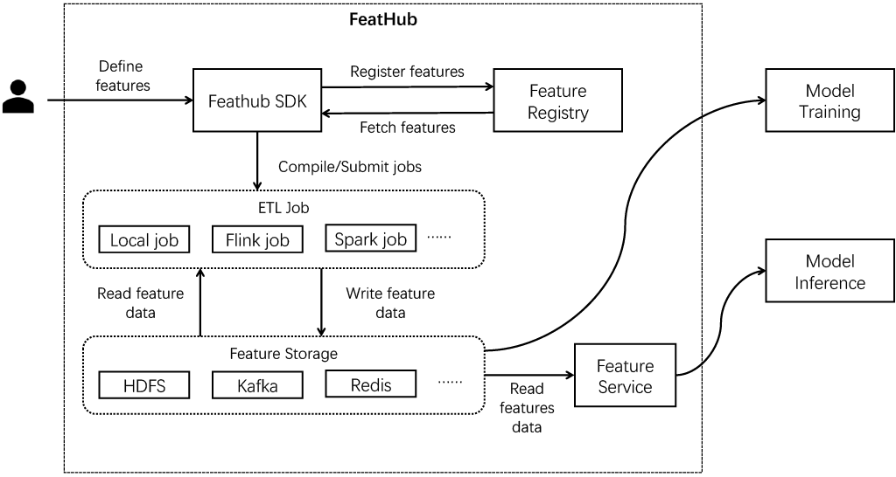

FeatHub is a stream-batch unified feature store that simplifies feature
development, deployment, monitoring, and sharing for machine learning
applications.

- [Introduction](#introduction)
- [Core Benefits](#core-benefits)
- [What you can do with FeatHub](#what-you-can-do-with-feathub)
- [Architecture Overview](#architecture-overview)
- [Supported Compute Engines](#supported-compute-engines)
- [FeatHub SDK Highlights](#feathub-sdk-highlights)
- [Get Started](#get-started)
- [Developer Guide](#developer-guide)
- [Roadmap](#roadmap)
- [Contact Us](#contact-us)
- [Additional Resources](#additional-resources)

## Introduction

FeatHub is an open-source feature store designed to simplify the development and
deployment of machine learning models. It supports feature ETL and provides an
easy-to-use Python SDK that abstracts away the complexities of point-in-time
correctness needed to avoid training-serving skew. With FeatHub, data scientists
can speed up the feature deployment process and optimize feature ETL by
automatically compiling declarative feature definitions into performant
distributed ETL jobs using state-of-the-art computation engines of their choice,
such as Flink or Spark.


## Core Benefits

Similar to other feature stores, FeatHub provides the following core benefits:

- **Simplified feature development**: The Python SDK provided by FeatHub makes
  it easy to develop features without worrying about point-in-time correctness.
This helps to avoid training-serving skew, which can negatively impact the
accuracy of machine learning models.
- **Faster feature deployment**: FeatHub automatically compiles user-specified
  declarative feature definitions into performant distributed ETL jobs using
state-of-the-art computation engines, such as Flink or Spark. This speeds up the
feature deployment process and eliminates the need for data engineers to
re-write Python programs into distributed stream or batch processing jobs.
- **Performant feature generation**: FeatHub offers a range of built-in
  optimizations that leverage commonly observed feature ETL job patterns. These
optimizations are automatically applied to ETL jobs compiled from the
declarative feature definitions, much like how SQL optimizations are applied.
- **Assisted feature monitoring**: FeatHub provides built-in metrics to monitor
  the quality of features and alert users to issues such as feature drift. This
helps to improve the accuracy and reliability of machine learning models.
- **Facilitated feature sharing**: FeatHub allows developers to register, query,
  and re-use production-ready feature definitions and datasets already generated
by other developers in the organization. This reduces the duplication of data
engineering efforts and the cost of feature generation.

In addition to the above benefits, FeatHub provides several architectural
benefits compared to other feature stores, including:

- **Real-time feature generation**: FeatHub supports real-time feature
  generation using Apache Flink as the stream computation engine with milli-second
latency. This provides better performance than other open-source feature stores
that only support feature generation using Apache Spark.

- **Stream-batch unified computation**: FeatHub allows for consistent feature
  computation across offline, nearline, and online stacks using Apache Flink for
real-time features with low latency, Apache Spark for offline features with high
throughput, and FeatureService for computing features online when the request is
received.

- **Extensible framework**: FeatHub's Python SDK is declarative and decoupled
  from the APIs of the underlying computation engines, providing flexibility and
avoiding lock-in. This allows for the support of additional computation engines
in the future.

Usability is a crucial factor that sets feature store projects apart. Our SDK is
designed to be Pythonic, declarative, intuitive, and highly expressive to
support all the necessary feature transformations. We understand that a feature
store's success depends on its usability as it directly affects developers'
productivity. Check out the [FeatHub SDK Highlights](#feathub-sdk-highlights)
section below to learn more about the exceptional usability of our SDK.


<!-- TODO: provide examples showing the advantage of python SDK over SQL. -->

## What you can do with FeatHub

With FeatHub, you can:
- **Define new features**: Define features as the result of applying
expressions, aggregations, and cross-table joins on existing features, all with
point-in-time correctness.
- **Read and write features data**: Read and write feature data into a variety
of offline, nearline, and online storage systems for both offline training and
online serving.
- **Backfill features data**: Process historical data with the given time range
and/or keys to backfill feature data, whic
- **Run experiments**: Run experiments on the local machine using
LocalProcessor without connecting to Apache Flink or Apache Spark cluster. Then
deploy the FeatHub program in a distributed Apache Flink or Apache Spark
cluster by changing the program configuration.

## Architecture Overview

The architecture of FeatHub and its key components are shown in the figure below.



The workflow of defining, computing, and serving features using FeatHub is illustrated in the figure below.



See [Basic Concepts](docs/content/concepts/basic-concepts.md) for more details about the key components in FeatHub.

## Supported Compute Engines

FeatHub supports the following compute engines to execute feature ETL pipeline:
- [Apache Flink 1.15](docs/content/engines/flink.md)
- [Aapche Spark 3.3](docs/content/engines/spark.md)
- Local processor, which is implemented using the Pandas library and computes features in the given Python process.


## FeatHub SDK Highlights

The following examples demonstrate how to define a variety of features
concisely using FeatHub SDK.

See [Tutorial](docs/content/get-started/tutorial.md) to learn more about how to
define, generate and serve features using FeatHub SDK.

- Define features via table joins with point-in-time correctness

```python
f_price = Feature(
    name="price",
    transform=JoinTransform(
        table_name="price_update_events",
        feature_name="price"
    ),
    keys=["item_id"],
)
```

- Define over-window aggregation features:

```python
f_total_payment_last_two_minutes = Feature(
    name="total_payment_last_two_minutes",
    transform=OverWindowTransform(
        expr="item_count * price",
        agg_func="SUM",
        window_size=timedelta(minutes=2),
        group_by_keys=["user_id"]
    )
)
```

- Define sliding-window aggregation features:

```python
f_total_payment_last_two_minutes = Feature(
    name="total_payment_last_two_minutes",
    transform=SlidingWindowTransform(
        expr="item_count * price",
        agg_func="SUM",
        window_size=timedelta(minutes=2),
        step_size=timedelta(minutes=1),
        group_by_keys=["user_id"]
    )
)
```

- Define features via built-in functions and the FeatHub expression language:

```python
f_trip_time_duration = Feature(
    name="f_trip_time_duration",
    transform="UNIX_TIMESTAMP(taxi_dropoff_datetime) - UNIX_TIMESTAMP(taxi_pickup_datetime)",
)
```

See [FeatHub Expression Language](docs/content/concepts/expression-language.md) for more details.

- Define a feature via Python UDF:

```python
f_lower_case_name = Feature(
    name="lower_case_name",
    dtype=types.String,
    transform=PythonUdfTransform(lambda row: row["name"].lower()),
)
```

<!-- TODO: Add SqlFeatureView. -->

## Get Started

### Install FeatHub Nightly Build


To install the nightly version of FeatHub and the corresponding extra
requirements based on the compute engine you plan to use, run one of the
following commands:

```bash
# Run the following command if you plan to run FeatHub using a local process
$ python -m pip install --upgrade feathub-nightly

# Run the following command if you plan to use Apache Flink cluster
$ python -m pip install --upgrade "feathub-nightly[flink]"

# Run the following command if you plan to use Apache Spark cluster
$ python -m pip install --upgrade "feathub-nightly[spark]"
```

### Quickstart

#### Quickstart using Local Processor

Execute the following command to compute features defined in
[nyc_taxi.py](python/feathub/examples/nyc_taxi.py) in the given Python process.

```bash
$ python python/feathub/examples/nyc_taxi.py
```

#### Quickstart using Apache Flink cluster

You can use the following quickstart guides to compute features in a Flink
cluster with different deployment modes:

- [Flink Processor Session Mode Quickstart](docs/content/get-started/quickstarts/flink-session-mode.md)
- [Flink Processor Cli Mode Quickstart](docs/content/get-started/quickstarts/flink-cli-mode.md)

#### Quickstart using Apache Spark cluster

You can use the following quickstart guides to compute features in a standalone
Spark cluster.

- [Spark Processor Client Mode Quickstart](docs/content/get-started/quickstarts/spark-client-mode.md)

## Developer Guide

### Prerequisites

You need the following to build FeatHub from source:
- Unix-like operating system (e.g. Linux, Mac OS X)
- x86_64 architecture
- Python 3.7
- Java 8
- Maven >= 3.1.1

### Install Development Dependencies

1. Install the required Python libraries.

```bash
$ python -m pip install -r python/dev-requirements.txt
```
 
2. Start docker engine and pull the required images.

```bash
$ docker image pull redis:latest
$ docker image pull confluentinc/cp-kafka:5.4.3
```

3. Increase open file limit to be at least 1024.

```bash
$ ulimit -n 1024
```

4. Make sure protoc 3.17 is installed in your development environment. You can
   follow the instructions in this
   [README](https://github.com/protocolbuffers/protobuf#protocol-compiler-installation)
   to install protoc.

### Build and Install FeatHub from Source
<!-- TODO: Add instruction to install "./python[all]" after the dependency confliction in PyFlink and PySpark is resolved. -->
```bash
$ mvn clean package -DskipTests -f ./java
$ python -m pip install "./python[flink]"
$ python -m pip install "./python[spark]"
```

### Run Tests

```bash
$ mvn test -f ./java
$ pytest --tb=line -W ignore::DeprecationWarning ./python
```

### Format Code Style

FeatHub uses the following tools to maintain code quality:
- [Black](https://black.readthedocs.io/en/stable/index.html) to format Python code
- [flake8](https://flake8.pycqa.org/en/latest/) to check Python code style
- [mypy](https://mypy.readthedocs.io/en/stable/) to check type annotation

Before uploading pull requests (PRs) for review, format codes, check code
style, and check type annotations using the following commands:

```bash
# Format python code
$ python -m black ./python

# Check python code style
$ python -m flake8 --config=python/setup.cfg ./python

# Check python type annotation
$ python -m mypy --config-file python/setup.cfg ./python
```

## Roadmap

Here is a list of key features that we plan to support:

- [x] Support all FeatureView transformations with FlinkProcessor
- [ ] Support all FeatureView transformations with LocalProcessor
- [ ] Support all FeatureView transformations with SparkProcessor
- [ ] Support common online and offline feature storages (e.g. MaxCompute, Redis, HDFS)
- [ ] Support online transformation with feature service
- [ ] Support integration with Notebook
- [ ] Support feature metadata exploration (e.g. definition, lineage, metrics) with FeatHub UI
- [ ] Support feature monitoring

## Contact Us

Chinese-speaking users are recommended to join the following DingTalk group for
questions and discussion.


English-speaking users can use this [invitation
link](https://join.slack.com/t/feathubworkspace/shared_invite/zt-1ik9wk0xe-MoMEotpCEYvRRc3ulpvg2Q)
to join our [Slack channel](https://feathub.slack.com/) for questions and
discussion.

We are actively looking for user feedback and contributors from the community.
Please feel free to create pull requests and open Github issues for feedback and
feature requests.

Come join us!


## Additional Resources
- [Documentation](docs/content/_index.md): Our documentation provides guidance
on compute engines, connectors, expression language, and more. Check it out if
you need help getting started or want to learn more about FeatHub.
- [FeatHub Examples](https://github.com/flink-extended/feathub-examples): This
repository provides a wide variety of FeatHub demos that can be executed using
Docker Compose. It's a great resource if you want to try out FeatHub and see
what it can do.
- Tech Talks and Articles
  - Flink Forward Asia 2022 ([slides](https://www.slideshare.net/DongLin1/feathub), [video](https://www.bilibili.com/video/BV1714y1E7fQ/?spm_id_from=333.337.search-card.all.click), [article](https://mp.weixin.qq.com/s/ZFKRNaQODe0LwRT1nlwZgA))
