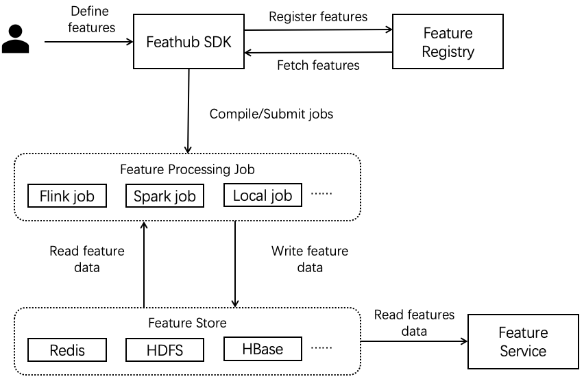

# Feathub

Feathub is a feature store that facilitates feature development and deployment
to achieve the following objectives:
- **Reduce duplication of data engineering efforts** by allowing new ML projects
  to reuse and share a library of curated production-ready features already
  registered by existing projects in the same organization.
- **Simplify feature management** by allowing users to specify feature
  definitions and feature processing jobs as code using a declarative framework.
- **Facilitate feature development-to-deployment iteration** by allowing users
  to use the same declarative feature definitions across training and serving,
  online and offline, without training-serving skew. Feathub takes care of
  compiling feature definitions into efficient processing jobs and executing those
  jobs in a distributed cluster.

Feathub provides SDK and infra that enable the following capabilities:
- Define feature-view (a group of related features) as transformations and joins
  of the existing feature-views and data sources.
- Register and retrieve feature-views by names from feature registry.
- Transform and materialize features for the given time range and/or keys from the
  feature view into feature stores, by applying transformations on source
  dataset with point-in-time correctness.
- Fetch online features by joining features from online feature store with
  on-demand transformations.

## Architecture and Concepts


The figure above shows the key components and concepts in the FeatHub
architecture.



The figure above shows how a developer can use FeatHub to facilitate feature
engineering for model training and model inference. Please checkout [Feathub
architecture and concepts](docs/architecture.md) for more details.

## Getting Started

### Prerequisites

Prerequisites for building python packages:
- Unix-like operating system (e.g. Linux, Mac OS X)
- x86_64 architecture
- Python 3.7
- Pip >= 21.3
- Java 8
- Maven >= 3.1.1

### Install Feathub

#### Install Nightly Build
According to the processor you plan to use, run any of the following commands to
install the preview(nightly) version of Feathub and the corresponding extra
requirements.
```bash
# If you are using local processor, run the following command
$ python -m pip install --upgrade feathub-nightly

# If you are using Flink processor, run the following command
$ python -m pip install --upgrade "feathub-nightly[flink]"

# If you are using Spark processor, run the following command
$ python -m pip install --upgrade "feathub-nightly[spark]"
```

#### Install From Source
Run the following command to install Feathub from source.
```bash
# Build Java dependencies for Feathub
$ mvn clean package -DskipTests -f ./java

# Install Feathub
$ python -m pip install ./python
```

### Supported Processor

Feathub provides different processors to compute features with different computation
engine. Here is a list of supported processors and versions:

- Local
- Flink 1.15.2
- Spark 3.3.1

### Quickstart

#### Quickstart using Local Processor

Execute the following command to run the
[nyc_taxi.py](python/feathub/examples/nyc_taxi.py) demo which demonstrates the
capabilities described above.
```bash
$ python python/feathub/examples/nyc_taxi.py
```

#### Quickstart using Flink Processor

If you are interested in computing the Feathub features with Flink processor in a local 
Flink cluster, you can see the following quickstart with different deployment modes:

- [Flink Processor Session Mode Quickstart](docs/quickstarts/flink_processor_session_quickstart.md)
- [Flink Processor Cli Mode Quickstart](docs/quickstarts/flink_processor_cli_quickstart.md)

#### Quickstart using Spark Processor

Execute the following command to run the
[nyc_taxi_spark_client.py](python/feathub/examples/nyc_taxi_spark_client.py)
demo with Spark processor and compute the Feathub feature in Spark client mode
on your local machine.

```bash
$ python python/feathub/examples/nyc_taxi_spark_client.py
```

## Highlighted Capabilities


### Define Features via Table Joins with Point-in-Time Correctness

```python
f_price = Feature(
    name="price",
    transform=JoinTransform(
        table_name="price_update_events",
        feature_name="price"
    ),
    keys=["item_id"],
)
```

### Define Over Window Aggregation Features

```python
f_total_payment_last_two_minutes = Feature(
    name="total_payment_last_two_minutes",
    transform=OverWindowTransform(
        expr="item_count * price",
        agg_func="SUM",
        window_size=timedelta(minutes=2),
        group_by_keys=["user_id"]
    )
)
```

### Define Sliding Window Aggregation Features

```python
f_total_payment_last_two_minutes = Feature(
    name="total_payment_last_two_minutes",
    transform=SlidingWindowTransform(
        expr="item_count * price",
        agg_func="SUM",
        window_size=timedelta(minutes=2),
        step_size=timedelta(minutes=1),
        group_by_keys=["user_id"]
    )
)
```

### Define Features via Built-in Functions

```python
f_trip_time_duration = Feature(
    name="f_trip_time_duration",
    transform="UNIX_TIMESTAMP(taxi_dropoff_datetime) - UNIX_TIMESTAMP(taxi_pickup_datetime)",
)
```

### Define Feature via Python UDF

```python
f_lower_case_name = Feature(
    name="lower_case_name",
    dtype=types.String,
    transform=PythonUdfTransform(lambda row: row["name"].lower()),
)
```

## Additional Resources

- This [tutorial](docs/tutorial.md) provides more details on how to define,
  extract and serve features using Feathub.
- This [document](docs/feathub_expression.md) explains the Feathub expression
  language.
- This [document](docs/flink_processor.md) introduces the Flink processor that
  computes the features with Flink.
- This [document](docs/spark_processor.md) introduces the Spark processor that
  computes the features with Spark.
- [feathub-examples](https://github.com/flink-extended/feathub-examples)
  provides additional FeatHub quickstarts that cover key FeatHub APIs and
  functionalities.


## Developer Guidelines

### Installing Development Dependencies

1. Install the required Python libraries.

```bash
$ python -m pip install -r python/dev-requirements.txt
```
 
2. Start docker engine and pull the required images

```bash
$ docker image pull redis:latest
$ docker image pull confluentinc/cp-kafka:5.4.3
```

3. Increase open file limit to be at least 1024.

```bash
$ ulimit -n 1024
```

4. Make sure protoc 3.17 is installed in your development environment. You can
   follow this
   [README](https://github.com/protocolbuffers/protobuf#protocol-compiler-installation)
   to install protoc.

### Building Feathub Project
<!-- TODO: Add instruction to install "./python[all]" after the dependency confliction in PyFlink and PySpark is resolved. -->
```bash
$ mvn clean package -DskipTests -f ./java
$ python -m pip install "./python[flink]"
$ python -m pip install "./python[spark]"
```

### Running All Python Tests

```bash
$ pytest --tb=line -W ignore::DeprecationWarning ./python
```

### Code Formatting

Feathub uses [Black](https://black.readthedocs.io/en/stable/index.html) to format
Python code, [flake8](https://flake8.pycqa.org/en/latest/) to check
Python code style, and [mypy](https://mypy.readthedocs.io/en/stable/) to check type 
annotation.

Run the following command to format codes, check code style, and check type annotation 
before uploading PRs for review.

```bash
# Format python code
$ python -m black ./python

# Check python code style
$ python -m flake8 --config=python/setup.cfg ./python

# Check python type annotation
$ python -m mypy --config-file python/setup.cfg ./python
```

## Roadmap

Here is a list of key features that we plan to support. Stay tuned!

- [x] Support all FeatureView transformations with FlinkProcessor
- [ ] Support all FeatureView transformations with LocalProcessor
- [ ] Support all FeatureView transformations with SparkProcessor
- [ ] Support common online and offline feature storages (e.g. MaxCompute, Redis, HDFS)
- [ ] Support online transformation with feature service
- [ ] Support integration with Notebook
- [ ] Support feature metadata exploration (e.g. definition, lineage, metrics) with FeatHub UI
- [ ] Support feature monitoring

## Contact Us

Chinese-speaking users are recommended to join the following DingTalk group for
questions and discussion.


English-speaking users can use this [invitation
link](https://join.slack.com/t/feathubworkspace/shared_invite/zt-1ik9wk0xe-MoMEotpCEYvRRc3ulpvg2Q)
to join our [Slack channel](https://feathub.slack.com/) for questions and
discussion.

We are actively looking for user feedback and contributors from the community.
Please feel free to create pull requests and open Github issues for feedback and
feature requests.

Come join us!
